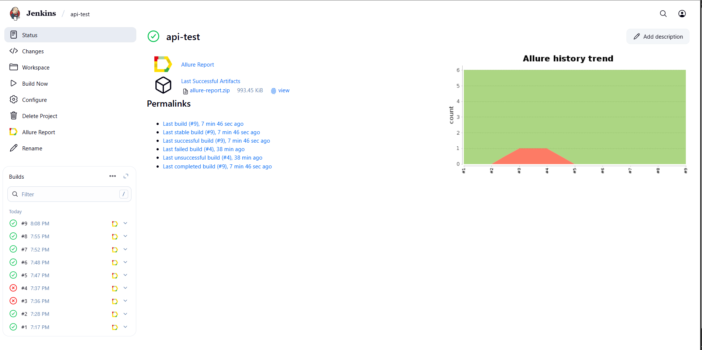
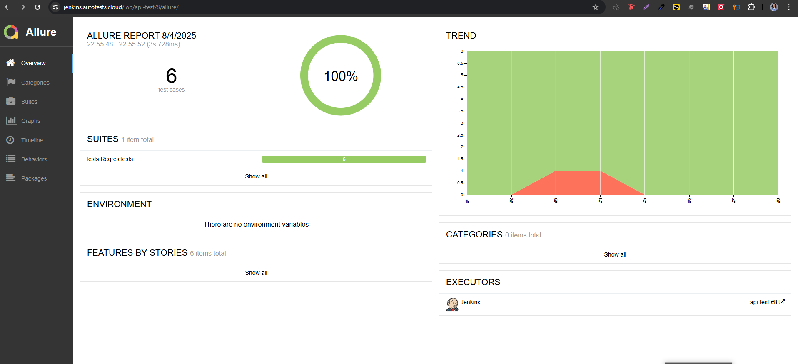
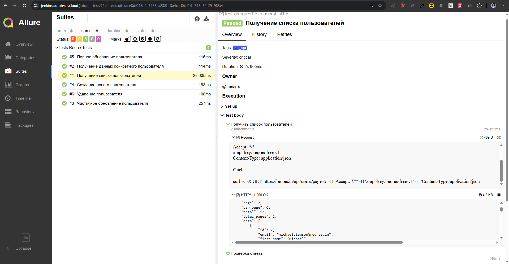
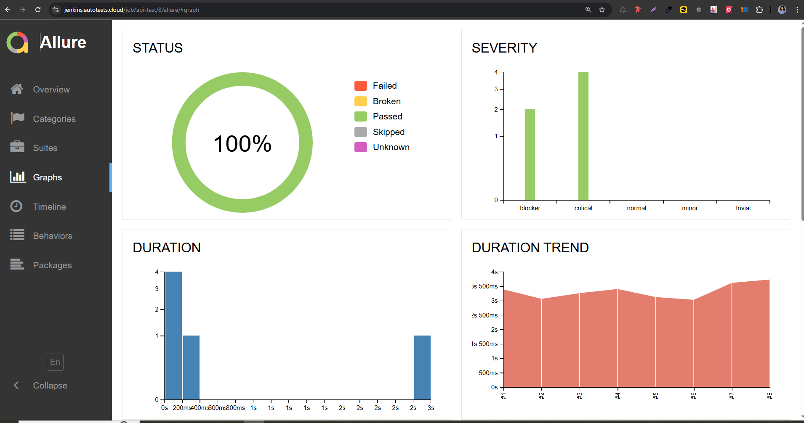
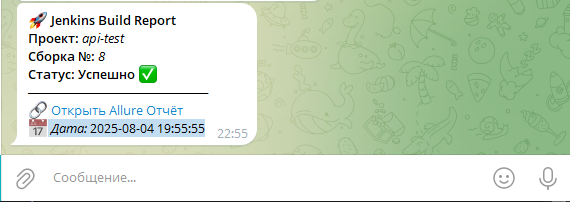

# Автоматизация тестовых сценариев для API сайта [Reqres.in](https://reqres.in/)


## Содержание
- [Технологический стек](#-технологический-стек)
- [API-тесты](#-api-тесты)
- [Запуск тестов в Jenkins](#-запуск-тестов-в-jenkins)
- [Allure-отчет](#-allure-отчет)
- [Уведомления в Telegram](#-уведомления-в-telegram)

## 💻 Технологический стек

<div align="center">
  <table>
    <tr>
      <!-- Первая строка -->
      <td align="center" width="110">
        <a href="https://www.jetbrains.com/idea/" target="_blank">
          
        </a>
        <br>IDEA
      </td>
      <td align="center" width="110">
        <a href="https://www.java.com" target="_blank">
          
        </a>
        <br>Java
      </td>
      <td align="center" width="110">
        <a href="https://junit.org/junit5/" target="_blank">
          
        </a>
        <br>JUnit 5
      </td>
      <td align="center" width="110">
        <a href="https://gradle.org/" target="_blank">
          
        </a>
        <br>Gradle
      </td>
    </tr>
    <tr>
      <!-- Вторая строка -->
      <td align="center" width="110">
        <a href="https://docs.qameta.io/allure/" target="_blank">
          
        </a>
        <br>Allure
      </td>
      <td align="center" width="110">
        <a href="https://www.jenkins.io/" target="_blank">
          
        </a>
        <br>Jenkins
      </td>
      <td align="center" width="110">
        <a href="https://github.com/" target="_blank">
          
        </a>
        <br>GitHub
      </td>
      <td align="center" width="110">
        <a href="https://rest-assured.io/" target="_blank">
          
        </a>
        <br>Rest-Assured
      </td>
    </tr>
  </table>
</div>

- Тесты написаны на **Java** с использованием фреймворка **Selenide** в **IntelliJ IDEA**
- Сборка проекта осуществляется через **Gradle**
- Запуск тестов в контейнерах **Selenoid**
- Интеграция с **Jenkins** + автоматическая отправка отчетов в **Telegram**

---

## 🌐 API-тесты

### Основные проверки
- ✅ Получение списка пользователей
- ✅ Получение данных конкретного пользователя
- ✅ Создание нового пользователя
- ✅ Частичное обновление пользователя
- ✅ Полное обновление пользователя
- ✅ Удаление пользователя
---

## [ Запуск тестов в Jenkins](https://jenkins.autotests.cloud/job/api-test/9/)


### Локальный запуск
```bash
gradle clean all_api_test 
```


### Удаленный запуск (Jenkins)

```bash
clean ${TASK}
```


## [ Allure-отчет](https://jenkins.autotests.cloud/job/api-test/9/allure/)

### Главная страница Allure-отчета


### Пример отчета о выполнении тестов


### График



##  Уведомления в Telegram

### После завершения сборки, бот, созданный в Telegram, автоматически обрабатывает и отправляет сообщение с результатом

<p align="center">

</p>
